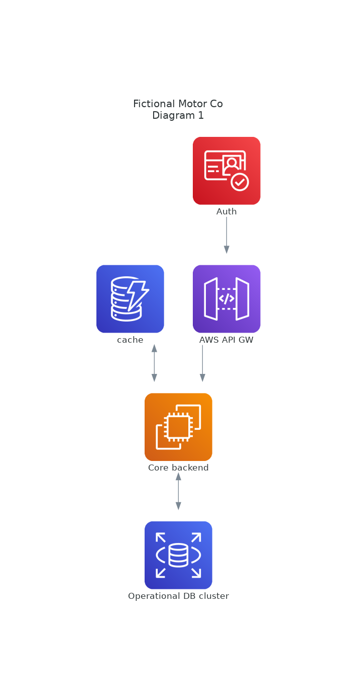

# Intro

In this document the architecture will be described, some decisions will be explained separatedly in Architecture
Decision Record (ADR).

## Assumptions

The cloud provider will be AWS
We will provide an API server, assuming the third parties will consume it.

## Iteration 1

In this section we will explain and bare minimum architecture with a monolithic approach but taking advantages
from the cloud provider. This description will partially match the prototype - although the prototype will
function as a local instance for simplicity.

This will work as the high level overview of the system, next iterations will break it apart, but the essence will
remain in this section.

### Description

We have 4 main elements in our architecture:

- AWS Cognito and AWS Gateway as entry path to our system, providing several features like Authorization, Authentication and
  Throttling, among others
- The backend, serving the REST API, initially an EC2 instance
- The persistence layer, an PostgreSQL database, over RDS (or Aurora)
- A cache server - an in-memory database- over AWS DynamoDB

For this approach we will have API Gateway, that will provide API endpoint caching and the possibility of easily
changing the components serving each endpoint, giving us the ability to scale each endpoint separately, if necessary.

### Decissions iter 1

- We will use Django + Django REST Framework as our backend, more info in [ADR1](./adr/adr1.md)
- We will use PostgresSQL as our DB, is a very capable SQL db, with interesting feature like materialized view
and good support for time-series approaches and Unicode

### Possible additions

Depending on the load that our service will maintain we could introduce:

- several instances of the same backend, scaling accordingly to the load
- a multi-instance postgres with separate read and write replicas
  - for it we will use pgconnect and pgpool2
- a materialized view for the data queried in our Sales per Model per period endpoints

## Iteration 2

We will extract out the Sales per model endpoint `/models/<pk>/sales` to a more capable microservice
We will implement this service with some small backend - maybe even a lambda - and DynamoDB

Also, we will allow RDS/Aurora to add more replicas, in a typical 1 write-master and 2 read-replicas set up.
Mind that RDS only allows 5 replicas, if insufficient, Aurora will be our next step.

The resulting architecture is shown in this diagram:

It is important to notice that we need some kind of materialization from our core backend and our new microservice.
This